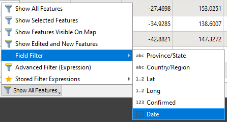

# Visualising the spread of COVID-19 using the QGIS temporal controller

With the feature packed release of [QGIS 3.16 LTS](https://www.qgis.org/en/site/forusers/visualchangelog316/index.html), I thought a great use case for a tutorial leveraging the temporal controller functionality was to visualise the spread of the COVID-19 Novel Coronavirus around the globe. This functionality was actually introduced by Kartoza back in version [3.14](https://www.qgis.org/en/site/forusers/visualchangelog314/index.html) and unifies the various legacy time management utilities into a single native tool.

This article outlines a simple method of visualising the spread of the pandemic using Free and Open Source GIS (FOSSGIS) tools and spatial data, making insights into the pandemic accessible to anyone, anywhere, gratis.


## TL;DR

It is expected that some of the readers of this article may not be very familiar with GIS or QGIS, so I have gone to great lengths to explain each processing step in great detail, often in a manner that can be understood by people unfamiliar with spatial analysis, such as home users, epidemiologists or local government officials.

I have short listed the processing steps taken to achieve this so that those familiar with GIS processing may dive right in:

1. Obtain relevant covid data or download it from [GitHub](https://github.com/CSSEGISandData/COVID-19).
2. Transform any time series "matrix" data into a record-per-entity-per-date using ```pandas.melt```. Be careful on how dates are formatted here though, and use the included pandas script to make quick work of the date formatting.
3. Import the csv as point data and join the confirmed cases, deaths and recoveries layers into a single table. Attributes for 'current' or 'active' cases can be calculated by simple subtraction, i.e. ```current=total-(deaths+recoveries)```.
4. Join the data to country areas. Positive cases are captured per testing location, however recoveries are often only listed on a countrywide basis, so these figures (and positions) need to be reconciled. To prevent massive data replication, we can use QGIS relationships to control our data.
5. Setup project temporal settings and produce spatial animations using the new temporal controller. Export animation frames and create a video file with KDEN Live, VirtualDub or something else entirely.
6. Next steps: Perform additional analysis processes (like hotspot emergence/ forecasting etc) and leverage location intelligence to get further insights.
7. Bonus: Get the full project and assets from [GitHub](https://github.com/zacharlie/effective-dollop/tree/main/covid19-world-timeline-qgis) to start hacking away immediately. Be sure to move the *natural_earth.gpkg* file from the [world maps](https://github.com/zacharlie/effective-dollop/tree/main/qgis-worldmaps) directory into the root of your Covid project directory to ensure it works.

## Raison d'être

The purpose of this article is to demonstrate the spread of COVID-19 across the world over time and showcases the temporal controller functionality of QGIS introduced in version 3.14 and available in the 3.16 LTS release. This has the benefit of being replicable by agencies and individuals anywhere in the world. When the same process is applied to localised data, this can have incredible benefit for decision makers, especially those involved with controlling the spread of the pandemic or when coupled with forecasting analysis. If you need help processing this workflow or need to build a solution for your own data, leave a comment or contact [info@kartoza.com](mailto:info@kartoza.com).

### What is QGIS Desktop?

QGIS Desktop is the leading FLOSS (Free-Libre Open Source) Desktop GIS (Geographic Information System) in the world, which allows users to download and utilise the software for free (gratis) across multiple desktop environments (Windows, Mac, Linux).

> That means it let's you make maps and perform advanced spatial analysis for nothing but the cost of the download bandwidth.

To get a free copy of QGIS Desktop, simply head over to the [QGIS download page](https://qgis.org/en/site/forusers/download.html).

If you want to get involved our need assistance with QGIS related issues, you can always send correspondence through to the [QGIS Mailing Lists](https://www.qgis.org/en/site/getinvolved/mailinglists.html) for community support.

## Making a map

Location data is not very useful at arbritary coordinates. The purpose of a map is often to show features positions relative to each other.

> "position is relative"  
>   *-- Not Einstein*

In order for us to make sense of the data we are wanting to represent, we will need an underlying 'basemap'. QGIS Makes this super easy, by making an online Web Map Tile service using data from the Open Street Map project available Out of The Box (OOTB). 

To add OSM tiles, simply expand the "XYZ Tiles" in the QGIS browser and drag and drop the OpenStreetMap layer into a new map frame to get started.


For the outputs produced in this series, I utilised my own custom "Dark Theme" world map built with high level country data obtained from the Natural Earth public domain dataset.

This world map project is freely available from my [QGIS World Map](https://github.com/zacharlie/effective-dollop/tree/main/qgis-worldmaps) directory.

The full COVID-19 project is [also available from GitHub](https://github.com/zacharlie/effective-dollop/tree/main/covid19-world-timeline-qgis).

## Current COVID19 worldwide status

To make a pretty map of how COVID19 has spread worldwide is remarkably simple. This is largely in part to the solidarity and cooperation of various bodies and agencies around the world who are actively tracking and analysing the spread of this pandemic.

### Simple static maps with online data

One, rather famous, example of the use of Spatial Inteligence for this purpose is the [JHU GIS Dashboard](https://coronavirus.jhu.edu/map.html). The JHU also provide this data on [GitHub](https://github.com/CSSEGISandData/COVID-19), which is important for us seeing as we will be using it for the time series information a bit later on...

The Dashboard provides links to the source data utilised within the dashboard, and the [AGOL Item Page](https://www.arcgis.com/home/item.html?id=c0b356e20b30490c8b8b4c7bb9554e7c) includes a link to the source feature service at the bottom of the page.


The ArcGIS Feature Service URL, ```https://services1.arcgis.com/0MSEUqKaxRlEPj5g/arcgis/rest/services/ncov_cases/FeatureServer```, can be copied for use in other software, so long as the licensing and permissions are configured to allow public use.

QGIS Desktop is capable of handling this data by allowing users to add ArcGIS Feature Services from within the file browser. Simply configure a new connection and insert the feature URL to make it available in the QGIS Browser. The feature can now be added by using the *Open Data Source* utility or simply using the Drag and Drop functionality from the QGIS Browser interface.


Once your point data is imported into the map as a new layer, you will need to style it to properly visualise the relevant data.

### Styling your point data

The most logical starting point for the representation of COVID cases is to symbolise features in accordance with the number of confirmed cases. For the layer in question, this information is stored within the point layer within an attribute field called "confirmed".

> To review feature attributes, simply right-click on a layer within the "Layers" panel and select "Open Attribute Table" from the context menu.

For representing the COVID Data in a manner that splits the symbols by the number of cases, we need to change the style of the layer by navigating to Layer Properties>>Symbology and changing the style from "Single Symbol" to the "Graduated" type from the available drop down menu. Setting the "value" for symbolisation will allow us to select the relevant "confirmed" attribute. Changing the "Mode" of classification to "Natural Breaks (Jenks)" will allow us to classify features by different symbols based on the ranges we specify.


Once we have specified suitable ranges for distinguishing areas with higher numbers of cases from areas with lower numbers of cases (in this instance, shades of red), and the result is a simple static map which is easily understood (albeit not the most pretty cartographic product ever).


We can improve the styles through any number of features provided by QGIS, not least of all being the "draw effects" system, which allows us to utilise a combination of effects often used for labelling engines and image manipulation programs, including feature outlines, shadows and different blending modes.


By using these draw effects, we can get a map more suited to your "nuclear threat movie scene" vision that I'm sure you had in mind when you started this exercise.


### Scaling your symbols

One of the key factors for this type of data visualisation is the scaling of points to ensure meaningful representation of the available data. It would make sense that the more cases there are, the bigger the point symbols should be. This isn't as simple as it seems, however, as you will need meaningful representations of data from 10 cases to 5000000 and everywhere in between, so a standard linear progression may not be the ideal method for data representation.

Scaling symbology in QGIS is covered in depth with Tim Sutton's [YouTube tutorial on Scalable Symbology](https://www.youtube.com/watch?v=_1QsZzMvGL4), which shows in detail how to use the *QGIS Size Assistant* to achieve this purpose.


With the size assistant, we can let QGIS automatically fetch our range of data values and style it according to our needs. This includes different methods for calculating the scale factor and the application of a "transformation curve" which is very useful for creating "breakpoints" when certain milestone values are reached.


My approach was to manually define this sizing ratio using the advanced QGIS *Expressions* functionality, which can be used for defining a great many project properties in a dynamic, data driven approach. This allows us to use dynamic and calculated values for most of our data representations including symbol size, for which I utilised a logarithmic calculation to represent the symbol size according to the value of an attribute. This allowed me to inversely stretch out my symbol range between the minimum and maximum inputs, regardless of the expected input value ranges obtained from the source data. This helps me use the same style for different layers with data which might change significantly over the course of time, which is handy when coupled with the copy and paste functionality available via the QGIS style manager context menu in the layers panel.


By setting the symbol size to an expression value, we are able to have our symbols scale in a suitable manner considering the data they represent.

A basic expression example is a logarithm value based on the attribute value of a feature, such as ```log10("confirmed"*100)```. If you're not familiar with logarithms, they're pretty much the inverse of exponents, so you can often get values much more meaningful for symbol representation by using them. If you want to experiment with finding suitable values, it's relatively simple by using an [online calculator](https://www.rapidtables.com/calc/math/Log_Calculator.html).

The following table displays some outputs of some samples of the input data values within the expected data ranges, which should make these expressions make a lot more sense to the uninitiated.

|log10 Input|Output value|
|---|---|
|1|0|
|2|0.30102999566|
|1000|3|
|1000000|6|
|5000000|6.6989700043|
|500000000|8.6989700043|

QGIS additionally offers the ability to scale elements in a linear or exponential fashion. In this situation, exponential scaling against the base10 logarithm of case numbers seems to yield a decent result. The size expression used in this map series is ```scale_exp(log10("confirmed"+1),0,10,0,20,2)```, however this can be modified according to your needs.

The method requires a number of elements to be used as described in the expression builder, with the function definition ```scale_exp(val,domain_min,domain_max,range_min,range_max,exponent)```, but I'll detail each element here just to make things easier for users who wish to modify this expression for their own use.

- val: The base value to scale the element by, in this case our attribute value. If you wanted to scale the symbol based on map scale, `@map_scale` could be placed here instead.
- domain_min: The minimum input value, so in the event that it is desired that any features with anywhere from 0 to 1000 cases may be represented in the same manner, 3 would be your minimum value. In our case, we wish to differentiate the entire range of data, so we'll set this to 0.
- domain_max: The maximum input value to represent. In our case, our maximum expected case number from the current dataset is around 6.7, and considering we want the entire range of data (no matter what it is), so we'll use a value of 10. If, for example, you wanted to represent every feature with over 1000000 cases as the same size, then you could set this value to 6. Setting it higher will stretch the scale for the range_max value to the domain_max value, so don't go to much higher than the largest expected output.
- range_min: Minimum possible symbol size.
- range_max: Maximum possible symbol size.
- exponent: The exponential value that the scale will increase by.

Although a bit verbose in it's representation here, in essence the principals governing these mechanics are rather simple, and are readily understood by comparing the results.


Although this scaling is useful when splitting up your symbols, it's perhaps a bit of a headache to wrap your head around this implementation, and using the size assistant symbol scaling tools are recommended for most novice users.

## COVID19 Spread over time

As much as this is an interesting view of COVID-19 worldwide, it doesn't really offer anything new that isn't already available online. The source data also doesn't have any temporal (time series) data embedded within it, so we can't effectively represent the spread of the disease over time.

This means we will need to go back to the drawing board and obtain the time series information from the [CSSEGIS COVID-19 Data](https://github.com/CSSEGISandData/COVID-19) we mentioned earlier. If you download that repo, there are 3 particular files of interest for us in the  ```COVID-19-master/csse_covid_19_data/csse_covid_19_time_series``` directory, namely:

- time_series_covid19_confirmed_global.csv
- time_series_covid19_deaths_global.csv
- time_series_covid19_recovered_global.csv

### Preparing the time series data

The time series data source is provided in a "2D Matrix" type format whereby each location feature has a column per date.

|Place|Attribute|01-01-20|02-01-20|03-01-20|
|---|---|---|---|---|
|Place 01|A|1|2|3|
|Place 02|B|4|5|6|
|Place 03|C|7|8|9|

We will need to transform each dates data into a new row for each feature. This is the input format we will require to represent time series data in QGIS.

|Place|Attribute|Date|Value|
|---|---|---|---|---|
|Place 01|A|01-01-20|1|
|Place 01|A|02-01-20|2|
|Place 01|A|03-01-20|3|
|Place 02|B|01-01-20|4|
|Place 02|B|02-01-20|5|
|Place 02|B|03-01-20|6|
|Place 03|C|01-01-20|7|
|Place 03|C|02-01-20|8|
|Place 03|C|03-01-20|9|

The end result will essentially convert a table with ~200 columns and 100 rows into a table with 10 columns and ~20000 rows, so don't be alarmed by the flood of data that follows. QGIS will help us make sense of this...

The method I used to achieve this output is the wonderful [pandas.melt](https://pandas.pydata.org/pandas-docs/stable/reference/api/pandas.melt.html) function. Pandas is a python library which is designed to facilitate the processing of tabular data.

What this process does is it transforms column "headers" for specified columns into unique rows for each element. The inputs it expects are the time series files and the number of attribute columns and date columns. If you want a shortcut to figuring out how many date columns there are in your inputs, a spreadsheet program like Libre Calc can help you by returning a count of highlighted columns. 


The script I used to process these tables (process_covid_results.py) is outlined below (the number of date fields was 277 on 25/10/2020, so you would need to adjust this according to the input data):

```python
import pandas as pd

def process_covid_csv(input_file, case_type='cases',
    attr_fields=1, date_fields=1):
    '''convert CSSEGIS COVID-19 time series data from 2D
    matrix into multi-row elements for use with QGIS
    https://github.com/CSSEGISandData/COVID-19'''
    df=pd.read_csv(input_file)  # input file to pandas dataframe
    column_names = df.columns.tolist()  # get a list of columns
    id_fields = column_names[0:attr_fields]  # attribute fields to replicate
    dates_end = attr_fields + date_fields  # get total number of columns
    data_fields = column_names[attr_fields:dates_end]  # get index of data field columns

    data = pd.melt(df, id_vars=id_fields, value_vars=data_fields,
                   var_name='Date', value_name=case_type)
    data.reset_index(drop=True)  # index cleanup
    output_file = case_type + '.csv'
    data.to_csv(output_file,index=False)  # save result to file
    print('{} exported...'.format(output_file))

try:
    process_covid_csv(input_file="time_series_covid19_confirmed_global.csv",
                      case_type='Confirmed', attr_fields=4, date_fields=277)

    process_covid_csv(input_file="time_series_covid19_deaths_global.csv",
                      case_type='Deaths', attr_fields=4, date_fields=277)

    process_covid_csv(input_file="time_series_covid19_recovered_global.csv",
                      case_type='Recoveries',  attr_fields=4, date_fields=277)

except Exception as err:
    print(err)
```

> Note that this process requires Python to be installed with the Pandas library available. If you have installed QGIS, python should already be installed, however QGIS does not contain the pandas library by default. Due to the many possible variations of available python environments, it is not possible to list full instructions on how to install pandas here. Further information is available from the [pandas documentation](https://pandas.pydata.org/pandas-docs/stable/getting_started/install.html).

Anaconda should have pandas available by default, however if you use miniconda, you will have to install it using the ```conda install pandas``` command. If you use python with regular pip, simply use ```pip install pandas``` (most Windows users) or ```pip3 install pandas``` (most Linux users) accordingly. Then create a script in the same location as the csv files you want to process, for example, ```process_covid_results.py``` and run that script from the relevant python environment for example ```python3 ./process_covid_results.py```.

One additional caveat is that this process does not account for any columns (or date ranges) you want to skip from the output, so be sure to delete them from the input csv prior to processing.

### Save the date

The [CSSEGIS COVID-19 Data](https://github.com/CSSEGISandData/COVID-19) uses a rather terrible (in my opinion) date formatting, in the style of ```M/D/YY```, but without any form of fixed padding or similar conventions. It makes this figure rather challenging for computers to easily interpret as an accurate date element. QGIS is pretty handy at modifying dates and also supports regex, but considering how especially terrible this particular formatting is, we'll rely on pandas again to fix up the date field.

The script I used to fix these date formats (fix_date_values.py) is outlined below:

```python
import os
import pandas as pd

def fix_covid_dates(input_file):
    df=pd.read_csv(input_file)  # input file to pandas dataframe
    df.rename(columns = {'Date':'old_date'}, inplace = True)  # rename the broken column

    # perform a date conversion that makes the values sensible for computers
    df['Date'] = pd.to_datetime(df['old_date'], format='%m/%d/%y', errors='ignore')
    # note the special use of %y instead of %Y to parse a 2 digit instead of a 4 digit year value
    del df['old_date']  # drop the broken column

    output_file = os.path.basename(os.path.splitext(input_file)[0]) + '_fixed.csv'
    df.to_csv(output_file,index=False)  # save result to file
    print('{} exported...'.format(output_file))       

try:
    fix_covid_dates('Confirmed.csv')
    fix_covid_dates('Deaths.csv')
    fix_covid_dates('Recoveries.csv')

except Exception as err:
    print(err)
```

The output dates should now be kebab-styled with a full 4-digit year value, e.g. ```2020-01-22``` and if you're still getting a old value, e.g. ```1/22/20```, something has gone awry.


If you want to troubleshoot these date conversion errors, you can remove the ```, errors='ignore'``` element from the *to_datetime* operation in the script, which will allow the operation to be halted when it encounters an error and will print out a response to the console similar to ```time data 'X/Y/Z' does not match format '%m/%d/%y' (match)```.

> Once the feature is imported, you will need to make sure the date type is actually a date value and not a string.



If you used a different workflow and the date field is a string, then you will have to generate a new column that is of the datetime type using the field calculator and the *to_date* function provided by QGIS.


### Importing the records as location data

Now that our data is processed, we will need to import it into QGIS as location data.

You should have the corrected files *Confirmed_fixed.csv*, *Deaths_fixed.csv* and *Recoveries_fixed.csv* available for import.

To import the data we will open the csv files using the Data Source Manager (common keyboard shortcut is ```Ctrl+L```).


From the data types tab on the left, select delimited text as the input data type. Browse to the source file and expand the **Geometry Definition** section to define how the system will interpret location information. Be sure to define *X* as **Long** and *Y* as **Lat**, which will tell the system to generate spatial positions for each record using the coordinate values in those columns. If you get it the wrong way around, the points will just be oriented vertically through the map (flipped perpendicular to where they should be), but don't worry, just remove the layer and import it again with the correct settings.

Next, we will need to define the CRS, or *coordinate reference system*, which will tell the system how to interpret those values. Your project should default to geographic coordinates (EPSG: 4326), but if 4326 is not available from the drop down, use the **Select CRS** button and search and select *4326* from the utility window.


After clicking the "Add" button, the points should show up as positions on the map.


Note that due to the way we processed the input data, each location is in fact multiple point features (one per day), so if you select an item with the "Identify" tool, it should show up as multiple points.


Remember that the time series records are split up into three files, so we need to import the confirmed cases, deaths and recoveries all separately.

> You may be concerned that there is a mismatch between the ArcGIS data shown earlier and the csv inputs, however this is not due to processing errors but actual omissions in the time series source data. If you search for "Hawaii" in *time_series_covid19_confirmed_global.csv*, you'll probably find that it's just not there...

### Joining cases, death and recovery records

A common operation required in data analysis, especially when utilising GIS and spatial analysis, is joining different data sources together. This can be a spatial join (by location) or an attribute based join, allowing two tables to be combined based on some common values (although other relationship types such as one to many are also supported in various operations, however this is beyond the current scope and we will just be performing a one-to-one relationship).

We have 3 Similar sets of records (confirmed cases, deaths and recoveries), each of these records carries specific information of a distinct location at a specific time. Our expected output is a single table, with a record for each place and time, which contains the number of cases, deaths and recoveries.

You can join the records in place (by joining everything in memory and without the need for further processing and exports), but you may end up with mismatched records which get dropped from the output. Because some readers might have input records with exact matches, or users may want to introspect a particular area which has a match, this is an important data processing step. It is not relevant to our workflow we use to generate our results here, but it may be useful to understand the steps so I have included the workflow below between the horizontal rules for posterities sake.

***

In order to perform a data join, we need to generate a unique *key* for each record which we can use as a common value to correlate common records between the distinct tables. You could likely use just the *State* and *Date* attributes to isolate unique records, but for the sake of maintaining high fidelity we shall use all the available records identifying attributes.

First, we need to add a column using the field calculator, which can be accessed via the attribute table widget or via the *Layer Properties>>Fields* tab.


The calculator window will allow us to create a new field, we'll call it "key", and automatically populate it with values that are calculated by an expression. In this instance, we'll make it a text field with hyphen separated values (although this could be anything) and use the expression ```"Province/State" + '-' + "Country/Region"  + '-' + to_string("Lat") + '-' + to_string("Long") + '-' +  to_string("Date")```. This let's us build a "superkey" which helps us ensure each records identity is ensured to be unique for each statistic type, which will help us with our join later. To be fair, the state and region fields would be perfectly adequate for this purpose, however I often join by all fields because it helps me spot errors, despite being a bit of an eyesore. It's also something we're not keeping around, so if you're intending on maintaining a field like this in a database, I would recommend dressing it up a little more.


Since we aren't really editing the underlying CSV table, QGIS is handily going to store this field in memory for us. Once we have joined all the relevant attributes, we will export the results to a suitable geodata format later and get rid of all this residual data used in the intermediate processing steps. Once we've added these "virtual fields" for each of our input layers (confirmed, deaths and recoveries), we can join them to each other by navigating to the *Joins* tab on the layer properties for a relevant feature layer.

To join your records in place, select the relevant layer and access the Joins tab on the layer properties. For this example we will process the *Confirmed* layer. Add two new joins and for the Deaths and Recoveries by using the green "plus" button at the bottom of the joins menu. Select the relevant layer from the drop down and specify the join fields (in his case *key* and *key*). By default, the join operation will copy each of the joined tables attribute fields and identify them by using the layername as a prefix for the field.

Because we are only interested in a single field value (all the other attribute fields would be duplicated anyway), we're going to specify which joined fields we want to include (*Deaths* or *Recoveries* respectively) and remove the field prefix by checking the "custom field name prefix" and removing the contents (just delete *Deaths_* and *Recoveries_*).


Your end result should be a really neat attribute table for the confirmed features layer that resembles the screenshot below.


Note that in this example the recovery information is incorrect, as certain locations (such as Canada) have different locations for confirmed cases and recoveries. Which is an undesirable outcome in this situation that we will prevent by using a merge function rather than a join.

***

As indicated in the above section, one of the challenges with representing the source data points on a map is the fact that some of the location positions do not match up with certain statistics. For example, cases are confirmed by a specific location, and each test centre can be a specific point on a map, however the recovery information could be sourced from a different location, such as a hospital, and in this particular instance it is only usually given by country.

In order for us to ensure that we don't misplace mismatched records, we are going to merge all the features into a single feature class. We will use the "Merge vector layers" utility from the QGIS Processing toolbox. This will allow us to also include records which do not match each other directly, but will be cleaned up in the next steps as described in the following (Joining records to locations).

First we will need to access the QGIS Processing Toolbox ```Ctrl+Alt+T``` and open the tools dialogue which is available from the under the *Vector Geometry* section. If the keyboard shortcut is a problem, you can also open the Processing Toolbox using the UI icon.


You should see the tool available within the processing toolbox, but if needed you can simply search for "merge" and all the tools related to various merge operations will be short listed for you.


We will need to select the layers to merge from the available layers list.


It's probably best we specify the output CRS (4326), but considering we will need to cleanup this data after the merge we can just leave the output as a temporary layer.


The merge function has now piled all of our points into a single feature layer. A query of a point should show that there are now 3 times the original number of features at a given location.


In order to reconcile these statistics, we are going to need to consolidate the statistics for each country. This is will be achieved by the "Aggregate" utility available from the QGIS Processing Toolbox (Ctrl+Alt+t) under *Vector Geometry>>Aggregate*.


You can select a field by clicking on it's ID on the left. The selected field should be highlighted. Use the *Delete selected field* button to remove irrelevant and extraneous fields, such as *Provice/State*, *key*, *lat*, *long*, *layer* or *path*.


We're going to group our values based on the *Country/Region* and *Date* fields by using the expression ```Array("Country/Region" ,"Date")```, because we still want a unique record for each day, and calculate the appropriate values by specifying whether the aggregation should simply copy the first value it encounters (Country and Date fields) or whether to tally the sum of the values encountered for each aggregated record (Confirmed, Deaths and Recoveries).


Once the aggregation is complete we should have a simple attribute table with just the data that we need, and which is simple and easy to understand. Using the identify tool on a point should also just return a single record per day once again.


At this point we can remove the "Merged" layer we generated previously and were keeping in memory, because this aggregated data is what we were really after.

### Determining active case numbers

One figure not accounted for in the supplied time series statistics is the number of currently active cases. At the start of the previous section on joining cases, death and recovery records, it was demonstrated how to utilise the field calculator functionality, which we can utilise to determine the number of active records and add that value to a new attribute field. As this particular attribute can be derived via simple arithmetic, we can add a new field for each record that calculates the current active cases by utilising the expression ```"Confirmed" - ("Deaths" + "Recoveries")```.


Be sure to save your changes by deactivating the edit mode initiated by the field calculator and clicking save when prompted.


Now you can easily symbolise based on the number of active cases to identify hotspots using the "Heatmap" function in QGIS. By setting the threshold to automatic, QGIS will decide how to symbolise hotspots on the fly based on the currently available data, keeping things in scope relative to the number of cases. That's pretty handy when used with the temporal controller, but more on that later.


The current result is a nifty hotspot map which isolates areas with high numbers of active cases.


### Joining records to locations

The aggregation tool doesn't really know what to do with the duplicated geometry features found for records with matching attributes but multiple geometry features. As a result, it just creates a multipart feature for each record to prevent data loss. This prevents data loss, but isn't necessarily that useful for representation within a map, because we have multiple points representing the same attributes, causing a bit of confusion.

To reconcile these records for mapping purposes, we will join them to the country boundary areas by matching the attributes between tables using the country name values.

Using our aggregated point record data, we can create a new set of features with all the information we want by joining it to the countries layer provided by natural earth.

Unfortunately, as these things go, some fields are not expected to be a direct match. What follows here is the process used to isolate the values used for the replacement algorithm in case other need to replicate the process on localised results.

To isolate these cases, I did a little bit of preliminary data wrangling. The simplest way to isolate these cases is to do an in place table join, but with hundreds of days of records that'll get a bit cumbersome. To limit the number of records for this join (and keep us sane), we can select by expression to isolate unique records for each country for only a single date. Selecting with ```"Date" = '2020-01-22'``` should yield 188 unique countries. I saved these filtered features using *Export>>Save selected features as* and then performed a join on the output features against the countries layer base on the *ADMIN* field. If we filter the resulting table where *Countries_fid* is NULL, we get a result of all the Cases which are not matched to elements on the Countries layer. If we cross reference this with the country names in the natural earth countries layer, we can create a table of replacement values which can be applied to the "Countries" field of our source data and ensure the join operation matches all the available results correctly.

The following table outlines the replacement values identified in this data wrangling exercise.

|Input Region|Country Name|
|---|---|
|Timor-Leste|East Timor|
|Korea, South|South Korea|
|Holy See|Vatican|
|North Macedonia|Macedonia|
|Bahamas|The Bahamas|
|Eswatini|Swaziland|
|Cote d'Ivoire|Ivory Coast|
|Congo (Kinshasa)|Democratic Republic of the Congo|
|Congo (Brazzaville)|Republic of the Congo|
|US|United States of America|
|Tanzania|United Republic of Tanzania|
|Taiwan*|Taiwan|
|Serbia|Republic of Serbia|
|Sao Tome and Principe|São Tomé and Principe|
|Burma|Myanmar|
|West Bank and Gaza|Palestine|
|MS Zaandam|This is a cruise liner|
|Diamond Princess|This is a cruise liner|

Now we need to open the attribute table for our "cases" point layer and use the field calculator to create a new field for country name which replaces these mismatched values.

The easiest (albeit inelegant) way for me to do this was to use the nested if statement (ugh!).

```
if("Country/Region"='Timor-Leste','East Timor',
if("Country/Region"='Korea, South','South Korea',
if("Country/Region"='Holy See','Vatican',
if("Country/Region"='North Macedonia','Macedonia',
if("Country/Region"='Bahamas','The Bahamas',
if("Country/Region"='Eswatini','Swaziland',
if("Country/Region"='Cote d''Ivoire','Ivory Coast',
if("Country/Region"='Congo (Kinshasa)','Democratic Republic of the Congo',
if("Country/Region"='Congo (Brazzaville)','Republic of the Congo',
if("Country/Region"='US','United States of America',
if("Country/Region"='Tanzania','United Republic of Tanzania',
if("Country/Region"='Taiwan*','Taiwan',
if("Country/Region"='Serbia','Republic of Serbia',
if("Country/Region"='Sao Tome and Principe','São Tomé and Principe',
if("Country/Region"='Burma','Myanmar',
if("Country/Region"='West Bank and Gaza','Palestine',
"Country/Region"))))))))))))))))
```

If the nested if makes you uncomfortable, remember that QGIS expressions also support CASE statements as well!

In the following example, I'm creating a new "replica" field to join on, but you can always replace the existing field value by checking the "update existing field" section in the field calculator.


Before we continue, let's create a duplicate of the "Countries" layer from the world group and rename it *"Country Cases"*. This the layer we will use to represent our results.

Now we *could* join the countries layer to the cases directly in QGIS, but that would yield a single join value for each country. This is a feasible approach if you just want to see the latest available data... So you could filter the cases by ensuring only the latest date is available and apply the join, but this doesn't give you the leverage you need to exploit the temporal controller. Alternatively, you could generate an entirely new dataset with the "Join by attributes" algorithm. That would generate a new geometry feature for each record (so a complete country boundary vector feature for every day) though, resulting in a very large output (I definitely don't recommend using geojson for this).

Instead, we will use a "relationship" definition. This allows QGIS to do the heavy lifting for use and find our data representations "on the fly". Defining the relationship is done in the project properties (as it affects multiple layers at once), and has a dedicated *Relations* tab.

Here we can link our cases records, based on the "Country" value we defined, to the Country Cases *ADMIN* field, in a dynamic manner.


Now, to retrieve an attribute value from the related (child) records, we can use QGIS Expressions.

**Note:** When creating and calculating the expressions, the relationship will take some time to do the relevant number crunching "under the hood". The current format of data distribution uses a geojson for case values, which is not optimised for performance. This is due to the data distribution channel and if you are performing this locally, it is recommended that you use a geopackage and index the data accordingly. Alternatively you could avoid this by sacrificing disk space and initial processing time in exchange for more efficiency. This is a "less dynamic" mode of operation and I would still recommend the use of relationships, however as this may not be optimal for the specific use cases of some readers, so I will include some notes on the join processes in the next section between horizontal rules.

***

In order to keep things simple, you could perform the join within the QGIS project by specifying the join criteria in the Join tab of the Layer Properties. Simply duplicate the *Countries* layer and apply the join to cases on the field values for our newly cleaned up *Country* field and the countries *ADMIN* field. The problem here is that there is only one record per day. As a result, I would recommend filtering your input "cases" data by a specific day. If you navigate to the layer properties, under "Provider Feature Filter" there is a query builder utility where you might input a filter similar to ```"Date" = '2020-02-01'``` so that the join is made on a known date and your data remains consistent.


To store a record for each country for each day, we will need to join the outputs and save the result to file. The resulting output is likely probably going to be pretty large (it will try duplicate the geometries for each day resulting in a dataset that's in the order of a number of gigabytes).


If you are short on processing capacity or storage space, you can easily avoid this overhead by generating centroids for the country areas before performing the join. For this demo, we are going to be making some "map magic" with the area features per day though, so we'll include the monolith for now.


Note that in this particular case, joining features via table attributes works well. That may not be the case if you're using localised data sources, so using a spatial join may make more sense depending on your specific situation. This will also vary based on input data quality. For example, some facilities in our inputs have 0:0 positions for lat:long, so we know that there are errors or omissions in the point sources. Additional wrangling may be required for a decent result, but this will vary from case to case.


The final cleanup operation is removing all the NULL value data that may have come through during the join process. Countries from the original data that do not have any records will have NULL values, which may show through in our styling expressions. We can fix this by simply converting NULL values for our expected fields to 0. A simple field calculator expression will help us do that with an expression like ```if("Active" IS NULL, 0, "Active")```.


Remember to select "run this on an existing field" and run the cleanup calculation on each respective attribute field.

***

### Styling the map areas

If you wanted, for example, to create a simple chloropleth map for the confirmed cases, we could simply create a new graduated symbol with the expression ```relation_aggregate(relation:='CountryCases',aggregate:='sum',expression:="Confirmed")```. This is not my favourite style though, so I'll store it in the layer styles in case we want to use it later.


If we wanted an effect similar in design to our previous map though, we could generate centroids dynamically from the country geometries with the geometry generator. We can set the symbol type to *Geometry Generator*, make sure the symbol type is *Point/ Multipoint* and set the expression for the feature generation to ```centroid($geometry)```. We may have some artifacts, such as the US centroid accounting for Alaska, but that's just what the data does and manual intervention would be required to fix that. Now each of our features will create a single centre point, which can be styled in the same fashion as our previous maps, but we will adjust the size calculation expression to utilise the result from our related record, so the size calculation should now be ```scale_exp(log10(relation_aggregate(relation:='CountryCases',aggregate:='sum',expression:="Active")+1),0,10,0,20,2)```. It may look rather complicated I'm sure, but once you understand the mechanisms driving this expression it's really not so bad, and the result is terrific.


One caveat here is that the automatic solutions for advanced point styles, such as heatmap generation, won't be available and you would have to generate point features by using the *Vector Geometry>>Centroids* tool available from the QGIS Processing toolbox.

### Setting up the temporal controller

Finally, after all of that data wrangling and configuration, we get to the bit we were after in the first place... the temporal controller settings.

To start off, we will need to isolate layers which we are going to assign temporal dimensions to and configure the temporal settings in the *layer properties*. Through all of the preprocessing to get to this point, it should be pretty obvious which layers you want to apply temporal controls to. In the case of relationships, we only really need to be applying these filters to the child features, so we can simply configure the temporal settings for the "Cases" layer, and the related styles for the "Country Cases" will be handled by QGIS automagically.

There are a couple of key configurations to manipulate here. Primarily for specifying the attribute field from which the time settings originate, and what length of time the date value represents (in this instance, one day).


Then we will need to navigate to *Project>>Properties*, or bring up the properties using the keyboard shortcut ```Ctrl+Shift+P```. The temporal settings need to be designated in the project properties before the temporal controller is utilised, otherwise no data will be available to the controller.

If you configured temporal settings for a layer already, the *Calculate from Layers* function will automatically figure out the earliest start and latest end dates available.


Once the settings have been configured we can open the temporal controller windows and start making animations.


The temporal controller contains three primary buttons for controlling the mode of operation, namely the disabled temporal navigation, fixed range navigation, and animated navigation modes.


The animation mode has a number of additional settings within the controller. The "golden cog" settings menu allows the fine grained control over the animation settings, including framerate adjustment and a cumulative range (which allows you to represent *all* the records from the defined start up until the specified time). Simply pressing the play button will play through the available date range. You may find that the rendering during animation is a bit patchy. Don't despair, as this is largely due to the amount of computational wizardry that's having to run under the hood to make these data representations. In order to filter the output by date, your computer needs to crunch through all the records and exclude all the records in your dataset for each day, as temporal indices are not clearly defined with the current technology that's available. What we'll do to generate a smooth animation is export the animation frames for a smooth user experience.


You can also add additional elements to the animation and map frame by using QGIS Decorations. You can add decorations to your map by navigating to the *View >> Decorations* menu in the QGIS interface.


In my example project, we see a map which uses a title decoration to represent the current date set in the Temporal Controller with the expression `[% format_date((@animation_start_time + make_interval(hours:=(hour(@frame_duration) * @frame_number))),'yyyy-MM-dd') %]`.

### Making animations

The temporal controller within QGIS Desktop allows for a number of animation settings, however the export function is currently limited to exporting single frames to still images.

Each image is given a name based on the frame number and the pattern outlined in the export window. To compile these into an animation video or animated gif, we need to use additional software tools.

A cross platform video editor with loads of additional functionality we can use to achieve this is [kdenlive](https://kdenlive.org/en/). Simply load up the application and add the images as a slideshow.


Select the animation frames folder and file format for the slideshow import. KDEN will automagically order the numbered images into a video slideshow. You can also adjust settings like the framerate and interframe animation from this menu.


Once the assets are added to the project bin, add it to the project "render" by using the drag and drop functionality.


You can also add additional media channels such as audio, intro videos and more to your kden live project. Once your video is ready for creation, use the "render" function to save the project as a video file.


Select your format and export the rendered video. I suggest using the WebM format.

For windows users, a small (~3.5MB download), portable software package which can be used to quickly stitch together these images is [VirtualDub](https://portableapps.com/apps/music_video/virtualdub_portable). This allows us to create AVI videos and animated gifs, but doesn't support the full range of functionalities available from a traditional non linear video editing software suite.


Simply use *File >> Open video file* and select the first image in the sequence, ensure that the "Automatically load linked segments" option is checked, and VirtualDub will stitch them together in a video. If you want to modify the playback speed, you can change the framerate under *Video >> Framerate*. Simply change the input framerate from the default (10 frames per second) to the adjusted rate by factoring it by 10. For example, if the frame rate is changed to 20, the playback is 2x speed, whilst changing it to 5 is 0.5x speed.

The output can be saved as an animated GIF from the *File >> Export* menu.

Numerous alternative video editing and animation software is freely available online. A quick way to find a bunch of them is by reading up on [alternatives to avidemux](https://alternativeto.net/software/avidemux/) or other tools such as [screentogif](https://www.screentogif.com/).

## Next Steps

There are a whole bunch of additional analysis opportunities which can be utilised but are outside the scope of this article, however I have listed some ideas for interested parties that may pursue this further.

- Automation: This process could be automated as long as the data inputs have consistent structures. QGIS supports various processing and automation mechanisms, including access to included FOSSGIS tools and libraries such as GDAL or GRASS. New builds of QGIS now offer access to the standalone processing module which can be used from the command line (or scheduled tasks/ cronjobs) to run the graphical models produced with the QGIS model builder. This allows "No Code" automation of geoprocessing which can be automated with a simple commandline script.
- You can generate reports in QGIS with the print layout manager and QGIS reports. These can be data driven by a number of filters and are especially useful when using temporal filters.
- Emerging or historic hotspot analysis. QGIS Desktop has support for heatmap and point cluster symbolisation out of the box, just to get started. More in depth analysis can be achieved with various forecasting models or moving average calculations. This can be coupled with the temporal controller for insights at specific points in the timeline.
- Visualisation and reporting (QGIS already has some graphing and report generation support built in) and calculation of additional statistics. QGIS server supports a number of the new OGC REST APIs and can expose your geodata to a range of additional utilities, including custom clinetside web based dashboards, pulling data and styles directly from your QGIS project file.
- Intersections of high risk areas with transportation routes to identify high-risk origination zones.
- Representing transmission rates in a spatial context (e.g. per capita, or relative to population size and density).
- Incidence rates, recovery rates, fatality and recovery ratios by area.
- Spatial analysis against environmental or demographic data (this is handy for identifying high risk zones as well as aggravation and mitigation factors).
- Identification of impending risk areas (areas of high population density or cases without access to facilities).
- Identification of overwhelmed facilities relative to areas with surplus resources.
- Much, much more.

The CSSE GIS Time Series data is great because of the work that goes into maintaining it and fixing historic errata, but similar tools can be built with live tools such as the [Disease API](https://github.com/disease-sh/API) if you want to build dashboard applications or charts.

A lot of useful insights can be generated by leveraging spatial analysis and the technologies that are freely available now allow anybody to do it. I can only hope that this article helps those who need it most, but if you have any challenges, get in touch or leave a comment. We'll try assist wherever we can.
