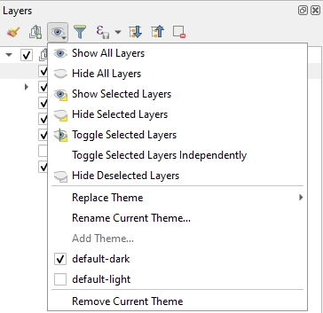
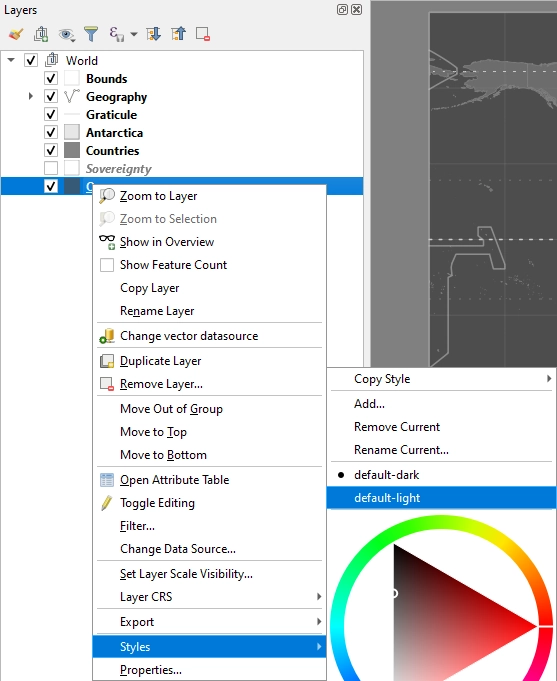
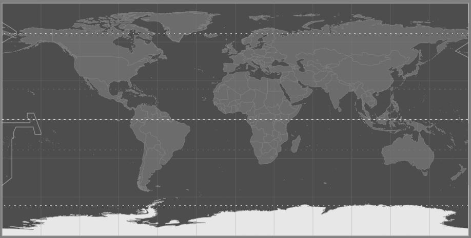
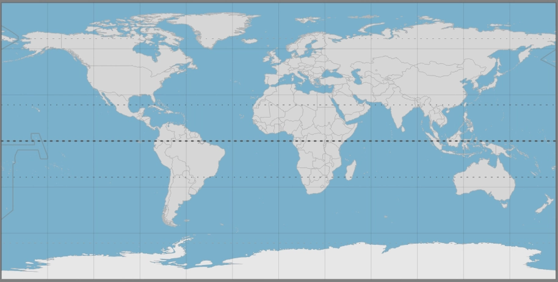

# QGIS Worldmaps

Basic worldmap styles for creating a basemap project with QGIS.

Download and load the qgs project to start. You can choose a theme from the layers panel in QGIS.

You can customise layers by changing or adding new styles wih the style manager.

You can customise layers by changing or adding new styles wih the style manager.

Example Dark Theme:

Example Light Theme:

## Contributing and Notes on Git

This project is primarily *distributed* on GitHub, and therefore, utilises git, however it should be noted that git is not optimised for *managing* this sort of project. If you want to contribute a custom theme or style, it's most likely going to be shared between the maintainers via other channels and simply published here instead.

Git uses delta versioning, so it's not ideal for binary files (like gpkg), compressed files (like qgz) and large xml structures which automatically update timestamps, change odd lines and may result in numerous overlapping conflicts (like qgs).

In addition, this is not expected to be a very active project, so it's been included with the effective-dollop repo. This might be a bit of a challenge for unskilled users as they will have to either download the entire repository, use a third party tool like curl/ wget or use the GitHub "RAW" data and save-as to get the specific file they want to use. If this becomes a major issue for people, make a comment on [Issue 7](https://github.com/zacharlie/effective-dollop/issues/7) and if there's enoguh interest I can make a new repository, however at this time i don't feel it's necessary.

The project primarily uses data from Natural Earth, stored in a local geopackage, but note that the *.gitignore* file excludes `*.gpkg`. This is because git is ill-suited for this type of data management and GitHub is used primarily for publication purposes. Updates to the underlying geodata

Changes to the QGIS project are also not well managed by git, so if you are using this project locally, you should probably include `.qgs` in the ignore file as well and only explicitly add the updated project to your remote repo for publication purposes or when you want a specific snapshot.

## Contributors

Considering the nature of the project, contributors will be added here manually instead of relying on GitHub or some other form of automated infrastructure.

| Avatar | User |
|:---:|---|
||[zacharlie](https://github.com/zacharlie)|
